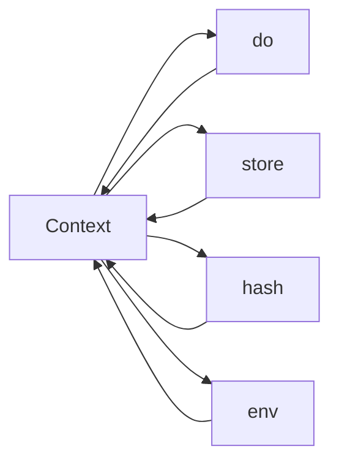
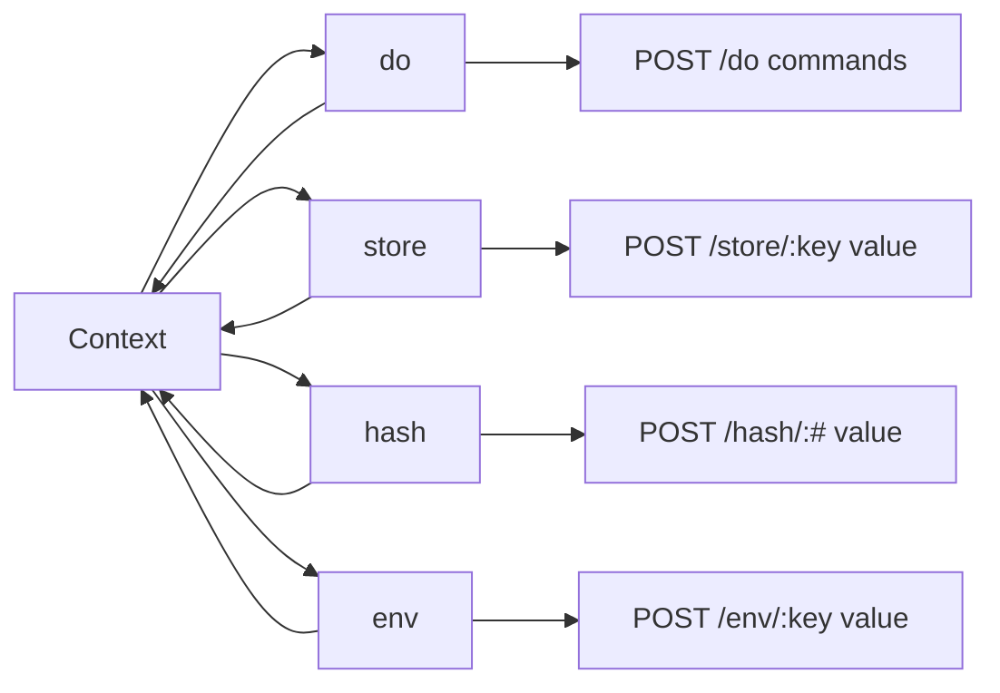

# State

The interpreter can be thought of as a finite state machine moving from one
context to the next.

We can map those state transitions onto different user interfaces 
like a command line or a web site.

# HTTP

Consider the following functional mapping for HTTP.

